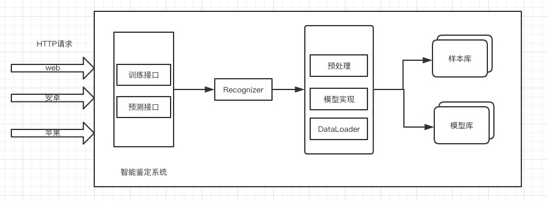
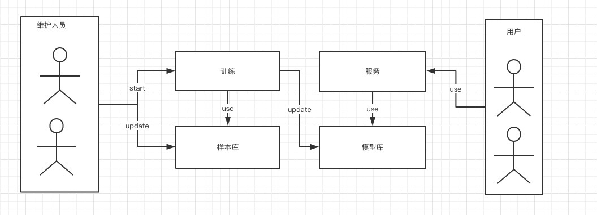
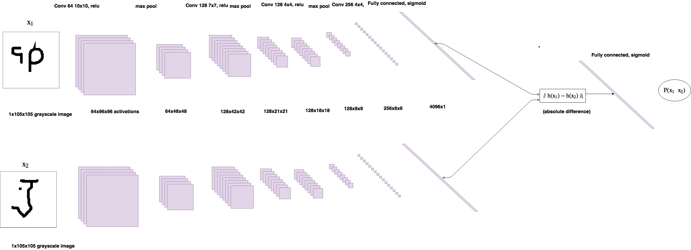

## 一 背景

### 1.1 业务背景

高端球鞋以及其他奢侈品的真伪鉴定的市场需求日趋强烈，纯人工鉴定的方式难以标准化规模化。

### 1.2 技术背景

机器学习以及机器视觉的发展让机器从图片鉴定产品真伪成为可能，但依旧面临如下严峻的问题待解决：

#### 问题

1. 样本量少。想用深度学习训练出一个效果好的自动分类模型，对各个分类的样本量要求往往在万级以上，但目前不论是正品样本还是仿品样本均远远达不到这个样本量。
2. 样本来源单一。深度学习所用的训练样本应尽量和线上预测环境的样本来源保持一致，如此才能保证模型学到的知识和它将来要去解决的问题需要的知识尽量匹配。需求沟通下来是预期会将模型使用在两个情景：一是公司内部员工使用；二是在线用户使用。但目前只有情景一的样本，这样很可能导致模型在情景一表现较好，但在情景二表现不佳。
3. 正品样本难以通过数据生成的方式去增加样本量。由于正品和仿品之间往往只有细微差别，数据生成要避免将正品样本的图片“污染”成非正品图片，这给自动生成样本带来了很大的挑战。
4. 业内尚无好的针对小样本的图片分类解决方案。

#### 方案

1. 样本量少：一方面尽量让样本收集的同学增加样本；另一方面设计数据生成算法，自动生成样本
2. 样本来源单一：期望样本收集的同学可以收集尽量贴近另一情景的样本。
3. 设计两个模型：一个模型使用常规的深度学习分类模型思路；一个模型去学习正品和非正品的差异值

|模型| 思路 | 优势 | 劣势 |
|---|---|---| ---|
|ResNet& DenseNet + 迁移学习| ResNet & DenseNet是图片分类中的明星模型，但这两个模型网络结构复杂，从0到1训练需要千万级的样本量，故使用迁移学习，将其在开源数据集的 ImageNet 的学习参数迁移至我们的模型，固定非全连接层的参数。将正伪鞋子的样本量分别增长到1万，用这两万的样本去训练模型最后一层全连接层的参数。 | 1. 该模型已经有很多成功的应用 |1. 模型的网络结构复杂，而样本的丰富度以及数量不足，模型可能过拟合 |
|自研 diffLearningNet| 1. 根据样本特征定制设计一个五层的卷积模型A，该模型用于提取特征，输出图片特征以及标签（真为1，假为0）； 2. 设计特征差异算法 M，将同一角度的真伪图片一对输入A模型，分别得到标签和特征，此算法负责计算两组特征之间的差异，输出差异值和标签（同为真1，后为假0）； 3. 设计分类器 B，接收 M 的输出，该分类器输出最终分类结果| 1. 根据样本特征定制开发，能自由调控卷积核以及网络层数，不易过拟合 2. 需要的样本量少，预计两个分类各1000张| 1.吃螃蟹的创新设计有可能失败 |

## 二 目标

### 2.1 系统功能列表

|功能| 做什么| 不做什么|
|---|---|---|
|训练真伪产品鉴定模型 | 提供易用的训练接口以及 ResNet& DenseNet & diffLearningNet 三个模型 | 训练数据需要每次自己定制处理 |
|预测真伪产品的接口 | 提供易用的预测接口 | 权限监控等功能|

### 2.2 接口准确性指标

|产品| 目标| 前提 |
|---|---|---|
| Nike Air Force 1 | 90%左右 | 1. 样本覆盖了所有正负特征（颜色，尺码等）  2. 样本与实际应用情景匹配 |
|Air Jordan 1 High Game Royal | 90%左右 | 1. 样本覆盖了所有正负特征（颜色，尺码等）  2. 样本与实际应用情景匹配|

### 2.3 接口性能指标

> 单张图片预测接口（不包含图片下载）

- CPU机器：第百分之 95 分位 2 分钟

- GPU机器：第百分之 95 分位 50 毫秒

## 三 系统架构

### 3.1 整体架构

### 3.2 业务流程

### 3.3 部署逻辑

1. 部署依赖：服务器需预装 docker, docker-compose, git
2. 部署代码： `sh deploy.sh`
3. 部署模型： `sh deploy_model.sh NikeAirForceRed `

> 系统所需环境均会封装在项目的 DockerFile 中

## 四 模块设计

### 4.1 diffLearningNet 设计

### 4.2 异常处理

1. 系统使用 Docker 自带的 log 支持，查看可进入项目目录运行 `sh logs.sh`
2. 异常错误码定义

| 异常码 | 异常说明 |
|---|---|
| 5001 | 系统内部错误，请联系技术|
| 2001 | 参数错误 | 
| 4001 | 对应模型不存在| 

## 五 接口设计

### 5.1 接口一览

| 接口 | 说明 |
|---|---|
| 训练接口 | Cli接口，启动训练 |
| 预测接口 | 预测传入的图片是否是正品 | 

### 5.2 接口说明

#### 5.2.1 训练接口

示例： `python train.py -t NikeAirForceRed -m diffLearningNet`

参数说明：

1. `-t`：指定训练的产品。样本库应有对应的样本集。
2. `-m`：指定训练使用的模型。模型实现文件夹应有对应的模型实现。

> 注：其他的模型超参数如损失函数，迭代次数等会定义在模型对应的配置中，在具体的应用中也需要调整

#### 5.2.2 预测接口

##### （1）Http

详情见接口设计文档

##### （2）cli

示例： `python predict.py -t NikeAirForceRed -m diffLearningNet -f shoebox -i http://test3.jpg`

参数说明：

1. `-t`：指定训练的产品。样本库应有对应的样本集。
2. `-m`：指定训练使用的模型。模型实现文件夹应有对应的模型实现。
3. `-f`: 指定要鉴别的特征
4. `-i`: 指定图片地址
